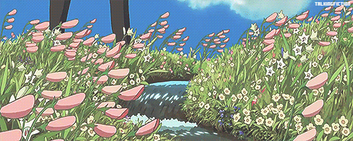
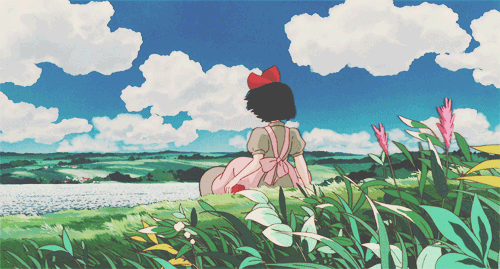

# 🌸 Ana Karen Cuenca Esquivel  

<strong>🎓 IT Student | 🌍 San Luis Potosí, Mexico | ✨ Passionate Software Developer</strong>

  

  

---

<h2 align="center">📫 Let's Connect!</h2>

  
  

<em>"If you can imagine, you can code it" </em>👾

 
---

## 📌 About Me  
Hi! I'm Ana, a final-year IT student with dual citizenship (Mexico/US). I love solving problems through code and creating innovative solutions.  

🔹 **Age:** 20  
🔹 **Main Interests:**  
- Full Stack Development  
- Data Analysis  
- Cybersecurity Basics  

---

## 🔥 Technical Skills  

### 💻 Programming Languages  
    

### 🌐 Web Development  
    

### 🛠 Other Technologies  
   

---

## 🚀 Current Experience  
- **BMW Intern** - Software Development  
- **Personal Projects:**  
  - CRUD Applications with React + Node.js  
  - Vue.js and Database Practice  

---

## 🌟 Fun Facts  
- 😸 Cat lover (adopting one soon!)  
- 🎮 Indie game enthusiast  
- 🌱 Always open to remote opportunities  

  

